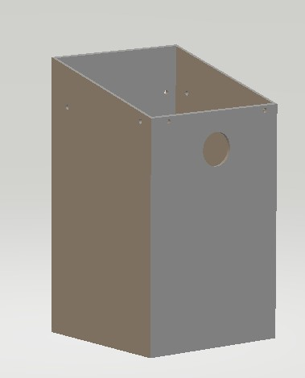
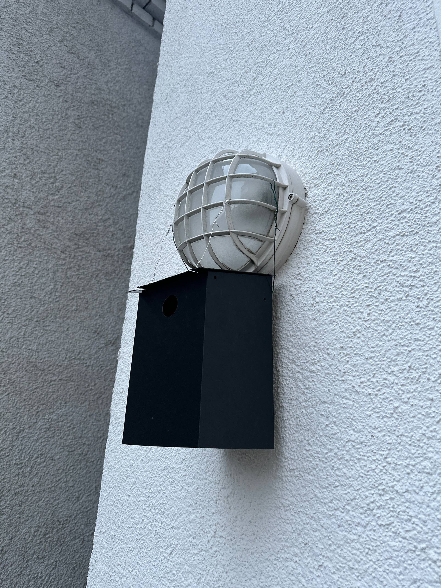

# Birdhouse for Titmouse (3D Printable)

A simple **3D-printable birdhouse designed for titmice and other small birds**.
The model is optimized for easy printing and outdoor use.

This project provides a lightweight birdhouse that can be printed on most consumer 3D printers and mounted outdoors.

♻️ Print responsibly!

This is a fairly large model (~500 g of PETG)!
Do not start printing if you’re unsure of the outcome!
Whenever possible, reuse the model multiple times to reduce plastic waste and be more eco-friendly.
---

## Preview

### 3D Model Preview



### Printed Birdhouse



---

## Files

``` ./
birdhouse
 ├ models
 │   ├ birdhouse.stl
 │   └ birdhouse_roof.stl
 ├ preview_body.jpg
 ├ printed.jpg
 ├ README.md
 └ LICENSE
```

### Model files

* `birdhouse.stl` – main body of the birdhouse
* `birdhouse_roof.stl` – removable roof

Both files are ready for **direct 3D printing**.

---

## 3D Printing

This birdhouse was printed using:

* **Printer:** Elegoo Centauri Carbon
* **Material:** Creality PETG (black)

### Recommended settings

* Layer height: **0.2 mm**
* Infill: **15–25%**
* Walls: **3 perimeters**
* Supports: **sometimes needed for the entrance hole — enable auto supports in your slicer if required**
* Material: **PETG/ABS recommended for outdoor use**
PETG or ABS is strongly recommended for outdoor use. PLA is **not suitable** as it will quickly deform or degrade under direct sunlight.

Color tip:  
Choose filament color based on your climate:  
- In colder regions, darker colors (like black) help absorb heat.  
- In hot climates, lighter colors are better to prevent overheating inside the birdhouse.

---

## Assembly

The birdhouse consists of two parts:

1. Main body
2. Roof

After printing:

1. Print both STL files
2. Attach the roof to the body
3. Mount the birdhouse on a tree or wall

---

## Installation Tips

To attract titmice and small birds:

* Install the birdhouse **2–4 meters above ground**
* Place it in a **quiet area**
* Avoid direct strong sunlight
* Ensure the entrance is protected from strong wind

---

## License

This project is released under the **MIT License**.
You are free to use, modify, and share the model.
